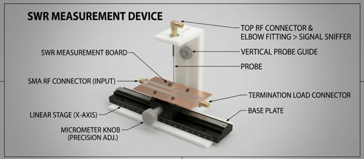

<h1 align="center">
Standing Wave Ratio (SWR) & Smith Chart Analysis
</h1>

## 🔹 Overview
This experiment focuses on analyzing **standing waves**, measuring the **Standing Wave Ratio (SWR)**, and using the **Smith Chart** as a graphical tool for RF system analysis.

The goal is to understand how impedance mismatch affects signal propagation in transmission lines and how it can be measured and corrected.

---

## 🔹 Objectives
- Understand standing wave formation in transmission lines  
- Measure **wavelength (λ)** and propagation constant (β)  
- Measure and calculate **SWR (VSWR)**  
- Determine **load impedance (Zₗ)**  
- Use the **Smith Chart** for impedance analysis and matching  

---

## 🔹 Principle of Operation

When a transmission line is not perfectly matched to its load:

- Part of the signal is reflected  
- Incident and reflected waves interfere  
- → Creates **standing waves**

Key parameters:
- Voltage maxima (Vmax)  
- Voltage minima (Vmin)  
- Reflection coefficient (Γ)  

---

## 🔹 Key Equation

SWR is defined as:

\
VSWR = Vmax / Vmin

---

## 🔹 Experimental Setup

- RF signal generator / sweep oscillator  
- Slotted transmission line  
- Detector + oscilloscope  
- Network Analyzer (VNA)  
- Matched load, short, and unknown load  
- Attenuators and RF components  

---

## 🔹 Procedure

1. Set up the RF system and calibrate instruments  
2. Measure **wavelength (λg)** using a slotted line  
3. Identify voltage minima and maxima  
4. Measure:
   - Vmax  
   - Vmin   
5. Calculate:
   - VSWR  
   - Reflection coefficient (Γ)  
6. Determine load impedance using:
   - Smith Chart  
   - Analytical formulas  
7. Perform impedance matching using a stub  

---

## 🔹 Observations

- Perfect match → VSWR ≈ 1  
- High mismatch → VSWR >> 1  
- Voltage pattern shifts with load impedance  
- Smith Chart provides intuitive visualization  

---

## 🔹 Results

- Measured wavelength and propagation constant  
- Calculated VSWR and reflection coefficient  
- Extracted load impedance (Zₗ)  
- Comparison:
  - Measurement vs Theory  

---

## 🔹 Applications

- RF transmission line analysis  
- Antenna matching  
- Microwave circuit design  
- Impedance tuning and optimization  

---

## 📷 Experiment Images

### 🔸 Experimental Setup

### 🔸 Standing Wave Pattern

### 🔸 Smith Chart Analysis

---

## 🧠 Notes

- Accurate positioning of probe is critical  
- Calibration affects measurement accuracy  
- Small errors in Vmin lead to large SWR errors  
- Smith Chart simplifies complex calculations  

---
